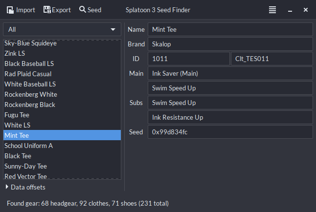

# s3-seed-viewer

You are probably looking for this: https://github.com/LegoFigure11/Splat3GearView

Still here? s3-seed-viewer is a GTK+/CLI project that takes a GDB dump of Splatoon 3's memory and searches for the offsets of gear data.
It currently does not communicate directly with a Switch, so it can be cumbersome to use and is why I recommend Splat3GearView over this.

I originally wrote this to expedite finding seed offsets for Splat3GearView, but it became more of a pet project to read [Leanny's Splatoon database](https://leanny.github.io/splat3/database.html) and manipulate the data myself.

Currently, it is capable of:
- Reading gear offsets for headgear, clothes, and shoes
- Updating a [leanny.github.io/splat3seedchecker](https://leanny.github.io/splat3seedchecker/#/) database backup

Additionally, the GTK+ frontend can:
- Display seeds for individual gear items
- Display translations for gear items in the supported languages
- Display gear abilities when the gear item has them

Windows support for the GTK+ frontend is TBD, though it may be possible to build this with MinGW as is.
